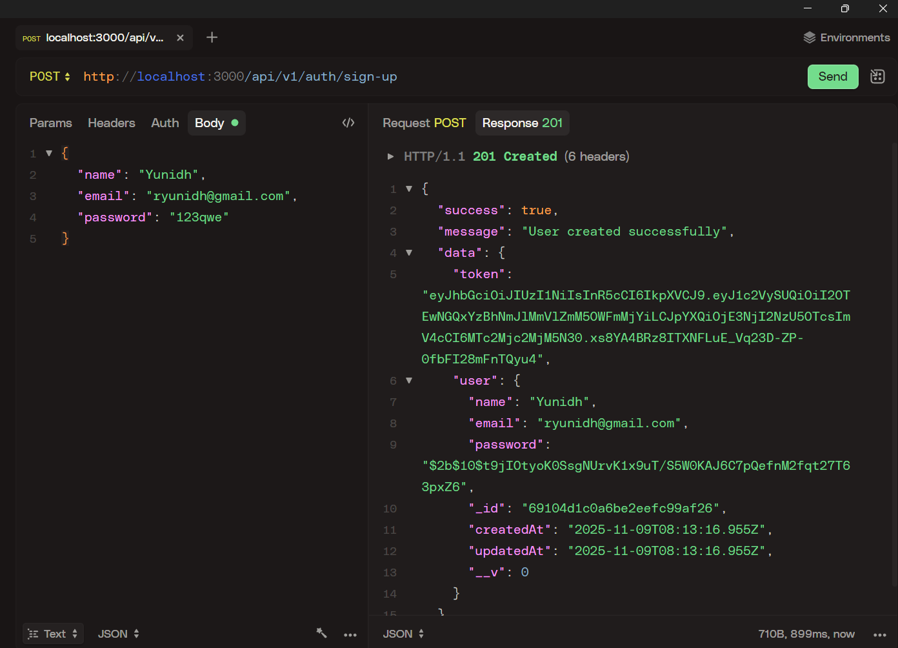

# subscription-management-system

Based on JavaScript Mastery's backend course on YouTube

## Features included:

1. Routes, using Express Router

   - in routes folder, \[auth,subscription,user\].routes.js files define all routes used by system which handle requests

2. Models

   - data schema definitions that are to be stored on **MongoDB** (defined using mongoose schema)

3. Middleware

   - standard express middleware: json, urlencoded
   - dependencies: cookie parser
   - error.middleware.js, handles specific error codes/name
   - auth.middleware.js, **authorize** handler function sits between requests made by routes to controllers/functions for security, only users with valid bearer tokens can make authorized requests (eg: when user checks personal account info, buys new subscription)

     - |        No bearer token        |        bearer token         |
       | :---------------------------: | :-------------------------: |
       |  |  |

   - arcjet.middleware.js, uses arcjet security tool for:
     - **rate limiting** using a token bucket filling algorithm
       | If user sends too many requests |  
       | :--------------------: |
       |  |

4. Controllers

   - auth.controller.js, handles authentication logic for sign up/in/out using JWT(JSON Web Tokens, short-lived and stateless tokens), these **bearer** tokens are created on user sign-in and expire in certain time limit(1 day)
     - | auth POST request using HTTPie (API testing tool) |
       | :-----------------------------------------------: |
       |   |
   - user.controller.js, handles retrieval of user data
   - subscription.controller.js, handles CRUD of subscription data (when provided with valid bearer token)
   - | subscription POST request(new subscription) | subscription GET request(view subscription info) |
     | :-----------------------------------------: | :----------------------------------------------: |
     |           |                 |
