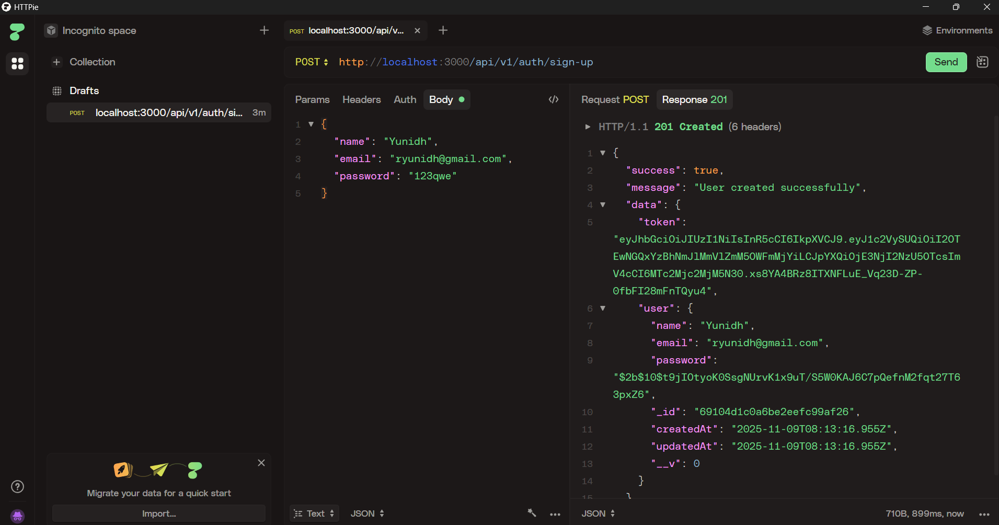

# subscription-management-system

Based on JavaScript Mastery's backend course on YouTube

## Features included:

1. Routes, using Express Router

   - in routes folder, contains \[auth,subscription,user\].routes.js files which handle individual routes

2. Models

   - data schema definitions to be stored on **MongoDB** (using mongoose)

3. Middleware

   - standard express middleware: json, urlencoded
   - cookie parser
   - custom: error.middleware.js, handles specific error codes/name

4. Controllers

   - auth.controller.js handles auth logic for sign up/in/out using JWT(JSON Web Tokens)
   - 
